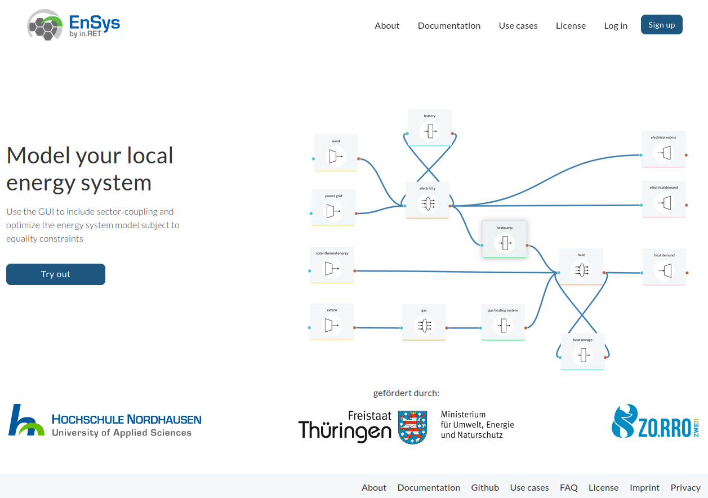
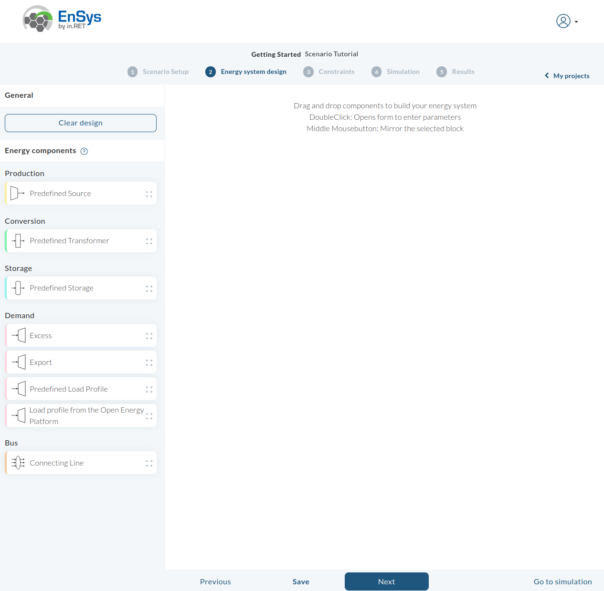
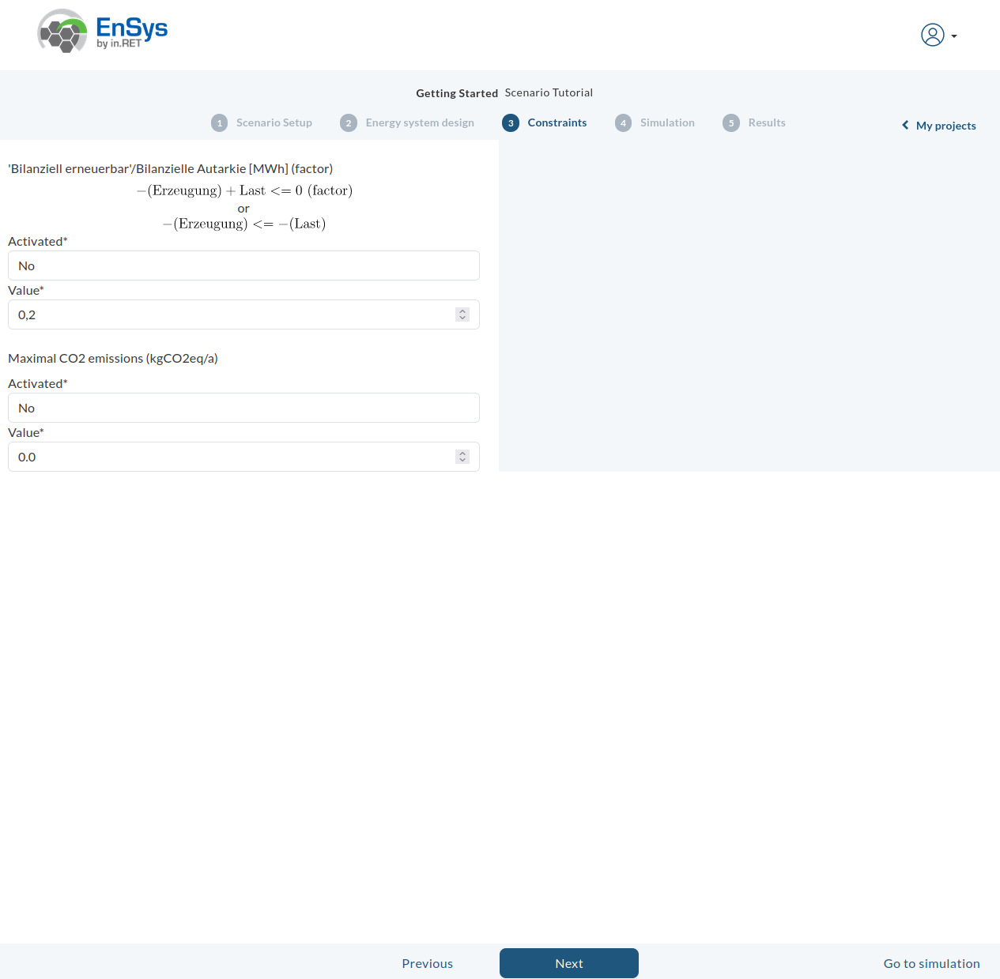
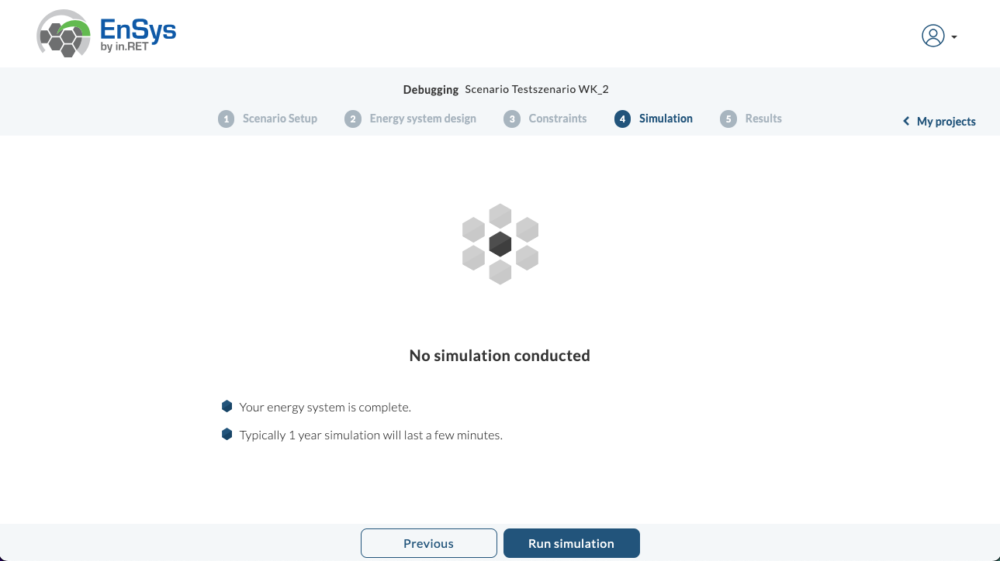

!!! info
    If you find some bugs don't hesitate to mail at <a href="mailto:ensys@hs-nordhausen.de">Hochschule Nordhausen</a>

## Start
After you visit the website the following page appears. This is our start.
<figure markdown>
  
</figure>

## Registration
Start the registration click the blue "Sign Up"-Button at the top right corner and fill in the following information: your name, email address, username and password. Finally, do not forget to read and accept the privacy statement. You should receive an email with a link to confirm the account creation.
<figure markdown>
  { width="250" }
</figure>
After the sign up you will recieve a activation-mail with further information to activate your account.
If the activation is done you can log in and see the following dashboard.

## Dashboard
<figure markdown>
  { align=right }
</figure>

As new user you doesn't find any project and scenarios. How you create and simulate is part of the next step.

The dashboard shows a navigation bar on top. On the right you can find a list of links and the dropdown menu for managing your account. On the left is the logo from "EnSys" which is also the homebutton.

On the bottom menubar you can find various links to information about the developer, our github repository, use cases which you can use to create scenarios, a short FAQ and legal notices like the imprint, privacy and license of the software.

## Create Project, Scenario, Energysystemmodell and Simulate

=== "Create Project"

    === "Create Project Menu"
        In the dropdown menu please choose "Empty Project" if you don't have a json-file with an exported project.
        Actually (Jan 2025) there are no use cases to choose from.
        <figure markdown>
            
        </figure>

    === "Create Project Form"
        Fill in the marked textfields, for your lattitude and longitude click on the map at the right. 
        You can zoom and move the map to locate you position.
        Afterwards select the three remaining points to create the project.
        <figure markdown>
            
        </figure>

=== "Create Scenario"
    After you created a project there on the right three dots which you can click to create a project. 
    After selecting "Create Scenario" you see the following screen and can fill out the given textfields to create a scenario.
    
    <figure markdown>
      
    </figure>

=== "Modelling the Energysystem"

    === "Before Modelling"
        This is the empty energysystem model. To Start with you can choose elements from the Box on the left.
        Creating nodes is simple by dragging the component to the canvas. After creation you can double click the component to specify all parameters.

        Repeat this to complete the modelling process.
        In between you can save your progress and return to the main page or continue later.

        <figure markdown>
            
        </figure>

        <figure markdown>
            
        </figure>
    
        <figure markdown>
            
        </figure>

    === "After Modelling"
        If you finished the modeling there is now a energysystem which can be simulated. To do so continue with step 4, Setup the constraints.
        <figure markdown>
            
        </figure>
    

=== "Set the constraints"

    !!! bug
        Under Construction and not tested. 

        <strong>Select "No" for both constraints and carry on.</strong>

    <figure markdown>
      
    </figure>

=== "Start the Simulation"
    
    Now the Simulation can be started by clicking "Run simulation" and after a short time the next screen should appear.
    <figure markdown>
        
    </figure>
    

=== "Show the results"
    
    Here you can see varios automatically generated infos from you energysystem. 
    These are general data from the simulation data.

    !!! feature
        (Upcoming) To generate better outputs from your simulation you can download the Simulationdata and generate you own plots and tables.

    <figure markdown>
      
    </figure>
